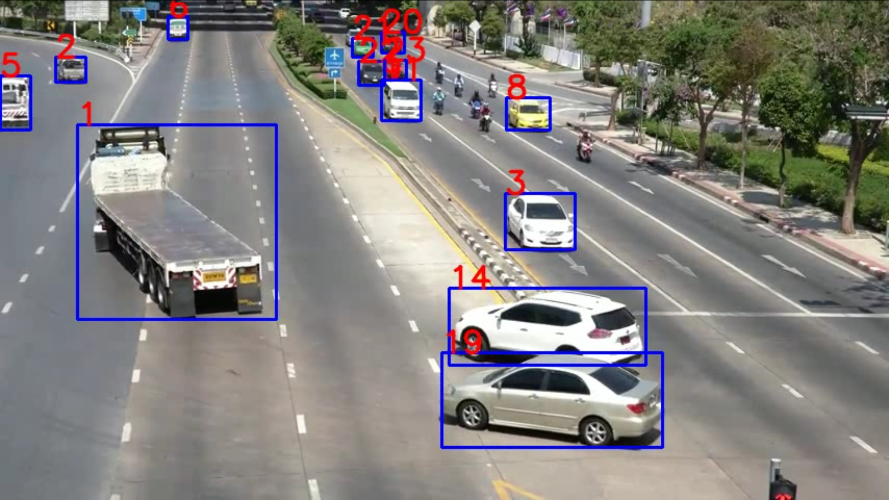

# Multi Object Tracking
 * Track just about anything that detectors can detect
 * Currently its using yolov5 for detections and Deepsort with Siamese Network for tracking
 * Siamese Network is trained on Nvidia AI City Challege Data (640 epochs) and VeRI Wild Dataset (33 epochs) pretrainied weights are provided

 * This Project is built on top of https://github.com/abhyantrika/nanonets_object_tracking and adds detector and capabilities to inference on video/live_feed 
 * Currently feature extracter is trained to extract features for vehicals but can be easily trained for other task also


## Demo Video 
<br>
<div align="center">

[](https://drive.google.com/file/d/1aVlaJogjbz8Q8KUvc3_b4ybravZwiPGT/view?usp=sharing)

</div>

## Steps to run tracker on custom Video
 * Download Yolov5 weights from this link https://github.com/ultralytics/yolov5/releases/download/v5.0/yolov5x6.pt
 * ```pip install -r requirements.txt ```
 * ```
    python custom_deepsort.py --yolo_weights PATH_TO_DOWNLOADED_WEIGHTS \
                            --source PATH_2_VIDEO_FILE \
                            --device GPU_ID_2_USE 
    ```
## Training steps 
 * Download dataset and save it in ``` object_tracking/datasets/train ``` and ``` object_tracking/datasets/test ``` (make sure format of data is correct i.e train/car_id/**images)
 * change default config
 * ```python siamese_train.py```

## Get Test Scores 
 * ```python siamese_test.py```

## Limitations
 * Beaware this dose not reid the object with same id if its out of frame for long interval of time 
## Refrences 
 * Siamese Net https://www.cs.cmu.edu/~rsalakhu/papers/oneshot1.pdf
 * DeepSort Paper https://arxiv.org/abs/1703.07402
 * https://github.com/ultralytics/yolov5
 * https://github.com/nwojke/cosine_metric_learning/
 * https://github.com/nwojke/deep_sort
 * https://github.com/abhyantrika/nanonets_object_tracking
